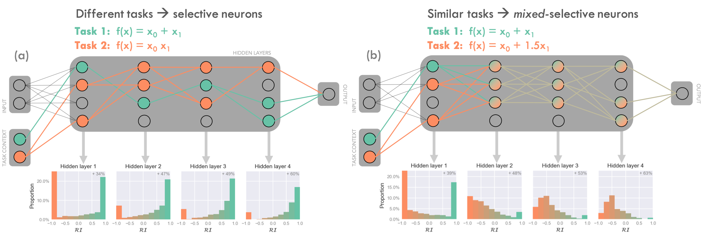
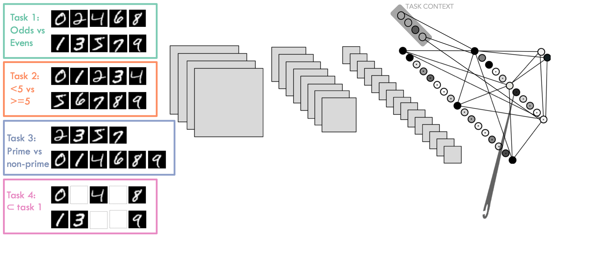
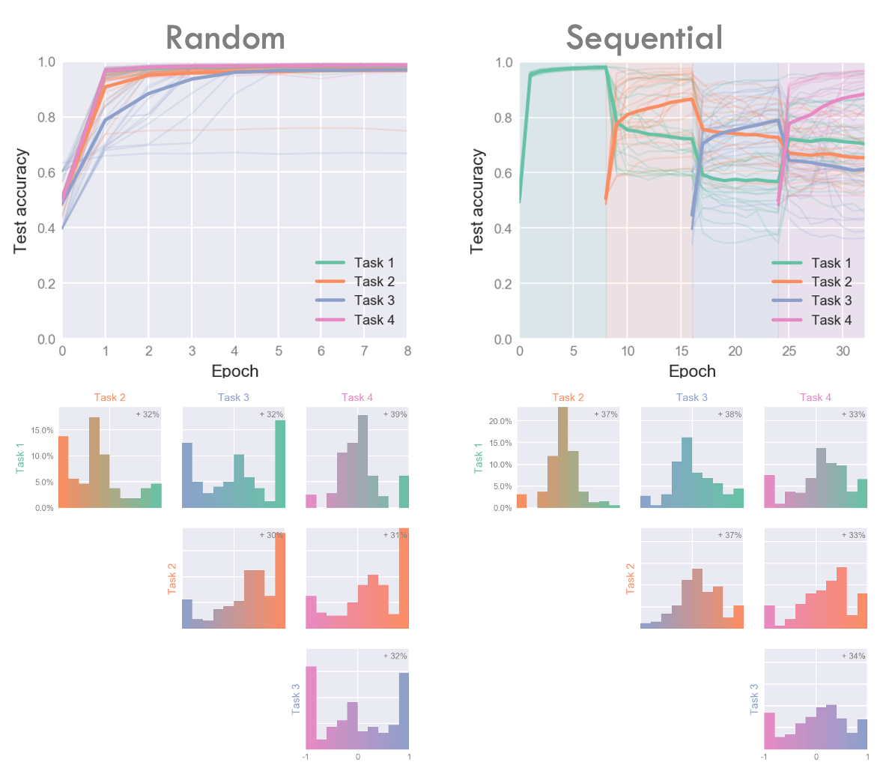

# WhatMakesNeuronsPicky

An important question in neuroscience is what determines whether neurons to learn "selective" representations (where they are important to one and only one task aspect, for example visual cortex) over "mixed-selective" ones (where they are important to multiple tasks or tasks aspects, for example PFC). 

Is it architecture, learning algorithm, or task structure which matters most? 

In this project I approach this question computationally by training artificial neural networks to learn multiple tasks an analysing neuronal selectivity. I find all three factors play a roll in determining whether neurons eventually become selective or mixed-selective.

Full report takes the form of , or see also  

## Conclusions: 
* Networks exploit task similarity, learning mixed-selective representation when the tasks are slight variants of each other (figure 1a).
* In the absence of other constraints, networks divide into distinct subnetworks (of selective neurons) when the tasks they must learn are highly dissimilar. Each subnetwork is responsible for one of the tasks (figure 1b).  
* When networks must learn many different tasks, learning selective representations is an optimal policy however this is unstable against overwriting when tasks are learned sequentially. 

## List of experiments performs: 
* A network learning two dissimilar tasks
* A network learns to similar tasks 
* A neuronally-constrained network learns two different tasks
* Which-task context info isn't provided until the penultimate layer
* A network learns two tasks sequentially vs simultaneously
* A Network learns two tasks but training biased towards one of the tasks (this is interesting!)
* A large CNN learns 4 overlapping MNIST-based tasks 

